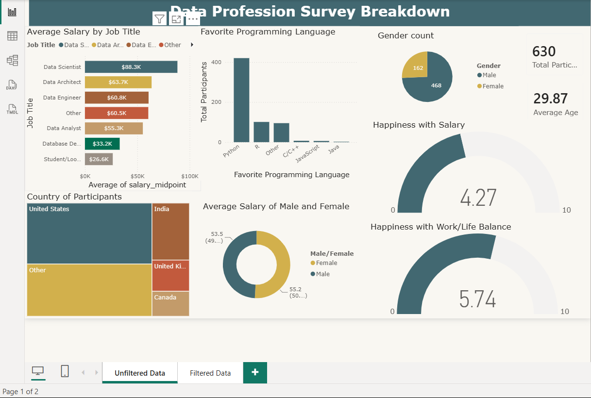
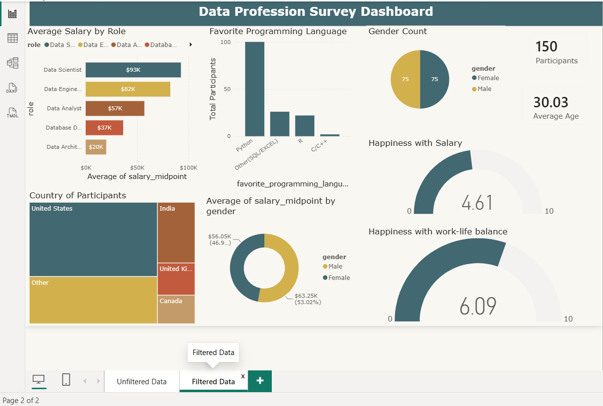

# Salary Gender Gap Analysis

**Tools:** Excel, SQL (MySQL Workbench), Power BI, Power Query

## Overview
Analyzed a 630-respondent salary survey dataset (468 male, 162 female) to test whether
the raw gender split was distorting the reported pay gap.

## What I did
- Cleaned the raw dataset in Excel: renamed columns for clarity and removed fields not
  relevant to the analysis
- Used SQL to build a randomly sampled, gender-balanced subset of 150 respondents
  (75 male, 75 female), filtering out ambiguous role and industry categories:

```sql
(SELECT *
 FROM analytics_survey
 WHERE gender = 'Male'
   AND `role` NOT LIKE "Other%"
   AND `role` != "Student/Looking/None"
   AND industry NOT LIKE "Other%"
 ORDER BY RAND(62)
 LIMIT 75)
UNION ALL
(SELECT *
 FROM analytics_survey
 WHERE gender = 'Female'
   AND `role` NOT LIKE "Other%"
   AND `role` != "Student/Looking/None"
   AND industry NOT LIKE "Other%"
 ORDER BY RAND(62)
 LIMIT 75);
```

- Cleaned and standardized salary ranges using Power Query
- Built two Power BI dashboards for comparison: one on the raw dataset, one on the
  balanced subset

## Key finding
The raw dataset showed a near-even salary split (50.8% female vs. 49.2% male). After
correcting for the gender sampling imbalance, the real pay gap turned out to be nearly
four times larger (female $63.25K vs. male $56.05K) than the raw numbers suggested.

## Why it matters
This shows how an unbalanced sample can mask a real disparity rather than reveal it,
a caution for anyone drawing conclusions from survey data without checking sample
composition first.

Full write-up: [[LinkedIn post]](https://www.linkedin.com/posts/ekow-ankrah-2a6569236_powerbi-dataanalytics-sql-ugcPost-7483816593588842496-oCft/?utm_source=share&utm_medium=member_desktop&rcm=ACoAADrQwF4B1S3ukZS3lde-hPhTivUrCUa8YmA))

   ## Dashboards
   **Raw dataset:**
   

   **Balanced sample:**
   
