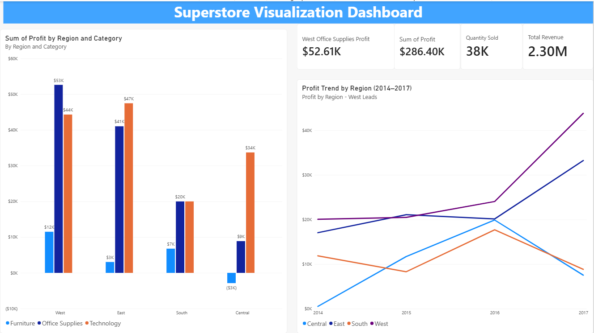

# Superstore Investment Recommendation Dashboard

**Tools:** Excel, Power Query, Power BI

## Overview
Analyzed Superstore sales data to answer one business question: which product
category and region should the business invest more in?

## Approach
Before opening Excel or Power BI, I planned the finding using a 4-step
communication structure:
1. Lead with the final recommendation, not the analysis process
2. Give 2-3 supporting reasons in plain terms
3. Acknowledge the trade-off or risk
4. Close with the recommended action

Only after defining what stakeholders needed to know did I decide which charts
were actually necessary, which is why the final dashboard has exactly two visuals.

## Dashboard

- **Column chart — Profit by Region and Category:** needed for a clear
  side-by-side comparison. It overturned my first instinct: the
  highest-revenue combination wasn't the most profitable one, one
  region-category pairing was losing money on every sale despite strong sales.
- **Trend line — Profit by Region (2014-2017):** confirmed the recommendation
  would still hold going forward, not just today.

## Recommendation to stakeholders
Invest more in Office Supplies in the West region. This combination yielded
the highest profit ($53K) from 2014-2017, 10.8% above the second-best
combination (East + Technology). The West was also the most profitable region
overall, growing 119% over the period, 23.7 percentage points ahead of the
next-fastest region (East, 95.3%).

**Trade-off:** Office Supplies' strong profit is concentrated in the East and
West, while Technology performs consistently across all regions. Given this,
the recommendation is to shift incremental budget toward Office Supplies in
the West while monitoring whether that strength holds in coming quarters.

## Why it matters
Chart count should be a consequence of what stakeholders need to decide, not
a goal on its own. Deciding what to communicate before deciding how to
visualize it is a habit worth building deliberately.

Full write-up: [LinkedIn post]([your-linkedin-url-here](https://lnkd.in/p/dFRxnX3v))
